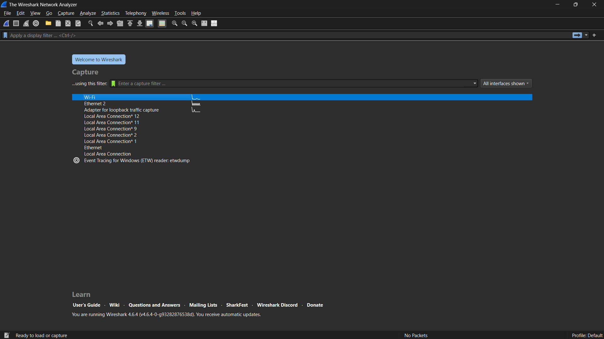
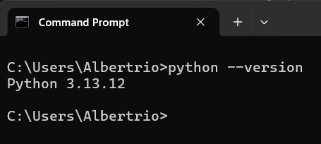

# LAPORAN PRAKTIKUM JARINGAN KOMPUTER - MODUL 1
## Running Modul

### Identitas Mahasiswa
**Nama:** Albertio Suranta Ginting  
**NIM:** 103072400128  
**Kelas:** IF - 04 - 01

---

## A. Tujuan Praktikum
1. Mahasiswa mengetahui aturan dan sistem pelaksanaan praktikum.
2. Mahasiswa mengetahui tools yang akan digunakan dan memastikan tools berfungsi dengan baik selama pelaksanaan pratikum.

---

## B. Persiapan Tools
Selama 16 pekan praktikum, terdapat 2 tools yang akan digunakan untuk mata kuliah praktikum jaringan komputer. Sebelum memulai praktikum, dipastikan bahwa tools yang akan digunakan telah terinstall sehingga dapat mengurangi kendala teknis selama pelaksanaan praktikum.  
### 1. Wireshark
Jika belum install dapat di download pada link berikut **[www.wireshark.org](http://www.wireshark.org/)**  
### 2. Python
Jika belum install dapat di download pada link berikut **[www.python.org](https://www.python.org/downloads/)**

---

## C. Hasil dan Pembahasan
### 1. Tampilan Awal Wireshark
Berikut adalah tampilan awal Wireshark sebelum membuka file trace. Terlihat daftar interface jaringan yang tersedia.  
  
*Gambar 1. Tampilan awal Wireshark*

### 2. Verifikasi Python
Berikut adalah tangkapan layar Command Prompt/Terminal saat mengecek versi Python.  
  
*Gambar 2. Verifikasi Python di cmd*

---

## D. Kesimpulan
Berdasarkan praktikum modul 1, dapat disimpulkan bahwa mahasiswa telah memahami tata cara pelaksanaan praktikum dan telah mempersiapkan tools utama, yaitu **Wireshark** dan **Python**, dan dipastikan dapat berjalan dengan baik pada perangkat yang digunakan.

---