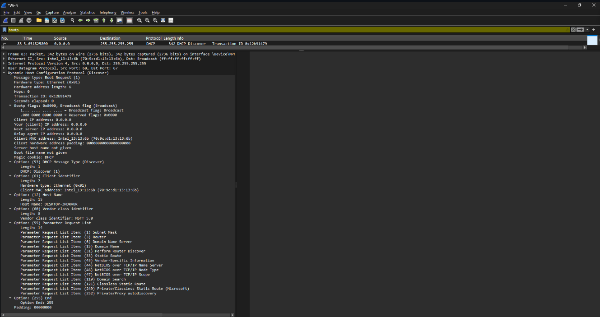
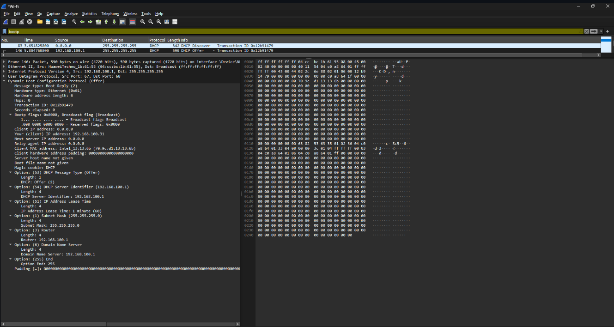
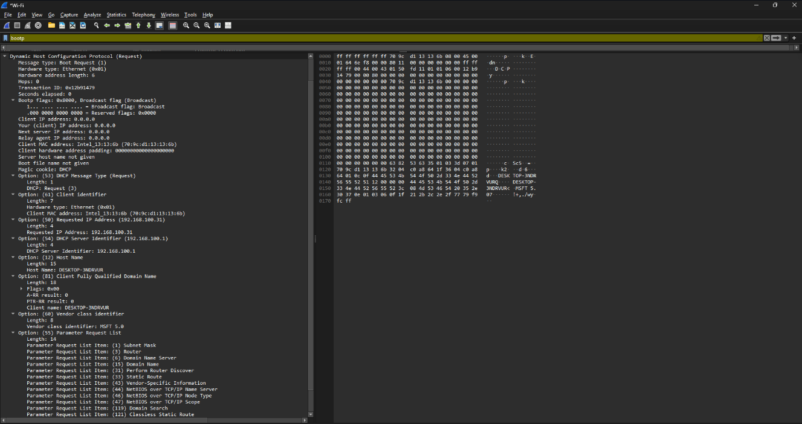
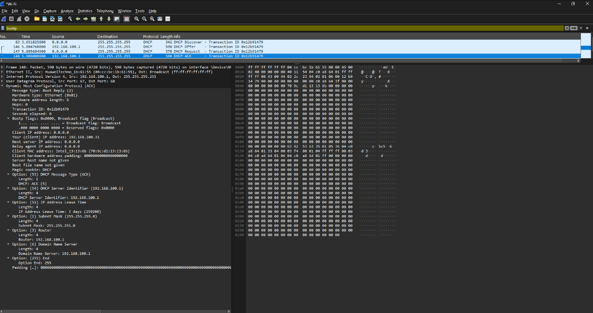

# **LAPORAN PRAKTIKUM JARINGAN KOMPUTER - MODUL 11**
## **DHCP**

### **Identitas Mahasiswa**
**Nama:** Albertio Suranta Ginting  
**NIM:** 103072400128  
**Kelas:** IF - 04 - 01

---

## A. Tujuan Praktikum
1. Menginvestigasi cara kerja protokol DHCP menggunakan Wireshark.

---

## B. Langkah Praktikum
1. Membuka *Command Prompt* (CMD).
2. Jalankan perintah `ipconfig /release` untuk melepaskan alamat IP yang sedang digunakan.
3. Memulai proses *capture* di Wireshark pada *Interface* jaringan yang aktif (Wi-Fi).
4. Jalankan perintah `ipconfig /renew` untuk memicu permintaan alamat IP baru.
5. Hentikan perekaman Wireshark setelah sistem mendapatkan IP baru.
6. Menggunakan parameter *filter* `bootp`.

---

## C. Hasil Praktikum

### 1. Tangkapan Paket DHCP

**Display Filter:** `bootp`


**Rincian Transmisi Paket:**

| No. Frame | Waktu | Jenis Pesan (Message Type) | Alamat Sumber | Alamat Tujuan | ID Transaksi |
|-------|-------|--------------|--------|-------------|----------------|
| 83 | 3.65s | DHCP Discover | 0.0.0.0 | 255.255.255.255 | 0x12b91479 |
| 146 | 5.80s | DHCP Offer | 192.168.100.1 | 255.255.255.255 | 0x12b91479 |
| 147 | 5.81s | DHCP Request | 0.0.0.0 | 255.255.255.255 | 0x12b91479 |
| 148 | 5.91s | DHCP ACK | 192.168.100.1 | 255.255.255.255 | 0x12b91479 |
| 401 | 11.49s | DHCP Request | 192.168.100.31 | 192.168.100.1 | 0x1a9df1b3 |
| 403 | 11.55s | DHCP ACK | 192.168.100.1 | 192.168.100.31 | 0x1a9df1b3 |

**Keterangan:**
- Frame 83 hingga 148 merepresentasikan siklus DORA inisial (efek dari `ipconfig /renew`).
- Frame 401 dan 403 menunjukkan proses perpanjangan masa sewa (*renewal*).
- Empat paket pertama beroperasi dalam satu sesi yang sama, dibuktikan dengan *Transaction ID* identik (**0x12b91479**).

### 2. Analisis DHCP Discover (Frame 83)



**Rincian Ekstraksi:**
```text
Message type: Boot Request (1) - Discover
Transaction ID: 0x12b91479
Client MAC address: Intel_13:13:13:6b (70:9c:d1:13:13:6b)
Client IP address: 0.0.0.0 (Status tanpa IP)

Options:
  (53) DHCP Message Type: Discover (1)
  (61) Client identifier
  (12) Host Name: DESKTOP-3NDRVUR
  (55) Parameter Request List:
    - Subnet Mask (1)
    - Router (3)
    - Domain Name Server (6)
    - Domain Name (15)
    - Serta 10 parameter tambahan...
```

**Interpretasi:**
Klien mengirimkan pesan *broadcast* secara massal untuk mendeteksi keberadaan *server* DHCP di jaringan. Karena belum mengantongi alamat IP, *Source IP* yang digunakan adalah `0.0.0.0`. Klien juga melampirkan daftar kebutuhan konfigurasi seperti *subnet mask*, *router*, dan DNS melalui *Option 55*.

### 3. Analisis DHCP Offer (Frame 146)



**Rincian Ekstraksi:**
```text
Message type: Boot Reply (2) - Offer
Transaction ID: 0x12b91479 (Konsisten dengan Discover)
Your (client) IP address: 192.168.100.31
Next server IP address: 192.168.100.1
Client MAC address: Intel_13:13:13:6b

Options:
  (53) DHCP Message Type: Offer (2)
  (54) DHCP Server Identifier: 192.168.100.1
  (51) IP Address Lease Time: 1 minute (60 seconds)
  (1) Subnet Mask: 255.255.255.0
  (3) Router: 192.168.100.1
  (6) Domain Name Server: 192.168.100.1
```

**Interpretasi:**
*Server* DHCP merespons dengan menawarkan parameter jaringan kepada klien, yang meliputi:
- **IP Target:** 192.168.100.31
- **Subnet Mask:** 255.255.255.0
- **Gateway (Router):** 192.168.100.1
- **DNS Server:** 192.168.100.1
- **Lease Time:** 60 detik (tenggat waktu penawaran yang sangat sempit).


### 4. Analisis DHCP Request (Frame 147)



**Rincian Ekstraksi:**
```text
Message type: Boot Request (3) - Request
Transaction ID: 0x12b91479
Client MAC address: Intel_13:13:13:6b

Options:
  (53) DHCP Message Type: Request (3)
  (50) Requested IP Address: 192.168.100.31
  (54) DHCP Server Identifier: 192.168.100.1
  (12) Host Name: DESKTOP-3NDRVUR
  (55) Parameter Request List (Subnet Mask, Router, dll)
```

**Interpretasi:**
Klien menyetujui tawaran dari *server* `192.168.100.1` dan membalas dengan permintaan formal untuk menyewa alamat IP `192.168.100.31` yang telah disodorkan sebelumnya.

### 5. Analisis DHCP ACK (Frame 148)



**Rincian Ekstraksi:**
```text
Message type: Boot Reply (5) - ACK
Transaction ID: 0x12b91479
Your (client) IP address: 192.168.100.31
Next server IP address: 192.168.100.1

Options:
  (53) DHCP Message Type: ACK (5)
  (54) DHCP Server Identifier: 192.168.100.1
  (51) IP Address Lease Time: 3 days (259200 seconds)
  (1) Subnet Mask: 255.255.255.0
  (3) Router: 192.168.100.1
  (6) Domain Name Server: 192.168.100.1
```

**Interpretasi:**
Ini merupakan tahap finalisasi di mana *server* memberikan persetujuan (*acknowledgment*). Terdapat fenomena menarik di mana *Lease Time* yang pada fase *Offer* hanya 1 menit, kini disesuaikan secara permanen menjadi 3 hari penuh (259.200 detik) untuk durasi sewa aktualnya.

### 6. Pembaruan Sewa / DHCP Renewal (Frame 401 & 403)

**Frame 401 (Proses Request Baru):**
- Menggunakan skema *Unicast* langsung dari klien (192.168.100.31) menuju *server* (192.168.100.1).
- Menghasilkan *Transaction ID* baru: `0x1a9df1b3`.

**Frame 403 (Proses ACK Baru):**
- *Server* menyetujui pembaruan masa sewa secara *Unicast* kembali ke klien.
- *Transaction ID* cocok dengan proses *Request* pembaruan (`0x1a9df1b3`).

---

## D. Analisis Praktikum

### 1. Proses DORA

**Durasi Inisiasi (DORA Awal):**
- Membutuhkan waktu sekitar **2.26 detik** dari titik peluncuran *Discover* (3.65s) hingga penerimaan *ACK* (5.91s). Melibatkan pertukaran 4 buah paket secara *broadcast*.

**Durasi Pembaruan (Renewal):**
- Berlangsung sangat singkat, hanya sekitar **0.06 detik** (dari 11.49s ke 11.55s). Efisiensi ini tercapai karena hanya melibatkan 2 paket komunikasi secara *unicast*.

### 2. Konfigurasi Jaringan yang Diberikan

| Parameter Konfigurasi | Nilai Diberikan | Penjelasan |
|-----------|-------|------------|
| **IP Address** | 192.168.100.31 | Identitas logis yang dipinjamkan ke klien |
| **Subnet Mask** | 255.255.255.0 | Menandakan topologi jaringan /24 |
| **Default Gateway** | 192.168.100.1 | Jalur keluar (router) menuju internet |
| **DNS Server** | 192.168.100.1 | Sistem penerjemah nama domain |
| **Lease Time** | 3 hari (259200s) | Batas kedaluwarsa masa peminjaman IP |

Berdasarkan *subnet mask*, IP *pool* yang bisa digunakan pada jaringan ini berkisar dari `192.168.100.1` hingga `192.168.100.254`, dengan alamat *gateway* dan DNS disatukan pada satu entitas *server* yang sama (`192.168.100.1`).

### 3. Konsistensi Identifier Transaksi

Protokol DHCP mengandalkan *Transaction ID* acak yang dibangkitkan oleh klien guna mencegah tumpang tindih sesi:
- **Sesi Inisial (Frame 83-148):** Seluruh empat tahapan mutlak berbagi *ID 0x12b91479*.
- **Sesi Renewal (Frame 401-403):** Karena ini adalah peristiwa baru, klien merakit *ID* yang berbeda (`0x1a9df1b3`) untuk dipasangkan dengan *ACK* dari *server*.

### 4. Metodologi Broadcast vs Unicast

- **Fase Awal (Broadcast):** Dikarenakan klien berstatus *"blind"* (tidak memiliki identitas IP dan tidak mengetahui letak *server*), pesan wajib diteriakkan ke seluruh host jaringan (`255.255.255.255`).
- **Fase Renewal (Unicast):** Saat waktu perpanjangan tiba, klien sudah sah memiliki IP dan mencatat alamat *server* secara spesifik. Pengiriman diarahkan secara presisi langsung ke *server* (`192.168.100.1`), sehingga mereduksi beban *traffic* keseluruhan jaringan.

### 5. Dinamika Lease Time

Perbedaan tajam masa sewa antara paket *Offer* (60 detik) dan *ACK* (3 hari) mengindikasikan bahwa *server* DHCP menggunakan waktu yang sangat singkat pada fase penawaran sebagai mekanisme pengamanan (*placeholder*). Jika klien tidak segera merespons (*Request*) dalam 1 menit, IP tersebut bisa segera ditawarkan ke perangkat lain. Durasi hak guna pakai yang sesungguhnya (3 hari) baru disahkan saat *server* mengirimkan tiket *ACK*. Dengan masa sewa 3 hari, sistem akan mencoba memicu proses *Renewal* ketika waktu mencapai 50% masa aktif (sekitar 1.5 hari).

---

## E. Kesimpulan

Dari eksperimen yang dilakukan, ditarik beberapa simpulan teknis:
1. Perekaman siklus komunikasi logis DHCP menggunakan Wireshark via *filter* `bootp` sukses mengekstraksi 4 paket inisiasi dan 2 paket pembaruan.
2. Mekanisme DORA terbukti secara hierarkis: diawali pencarian buta (*Discover*), disambut penawaran alokasi (*Offer*), direspons dengan permintaan definitif (*Request*), dan disahkan oleh peladen (*ACK*).
3. Parameter sinkronisasi komunikasi dijaga ketat oleh komponen *Transaction ID* yang konstan dalam satu siklus.
4. Klien berhasil menegosiasikan serangkaian konfigurasi absolut yang meliputi IP `192.168.100.31` (/24), beserta parameter *Gateway* dan DNS pada `192.168.100.1`.
5. Protokol memperlihatkan perilaku efisiensi yang adaptif: memulai dengan *broadcast* di saat belum memiliki IP (lambat), lalu bertransisi ke *unicast* untuk pemeliharaan status IP (sangat cepat).
6. Terdapat penerapan strategi penahanan (*hold timer*) pada *server* DHCP, di mana tawaran awal sengaja diatur sangat singkat (1 menit) sebelum dikunci secara permanen (3 hari) pada proses akhir komunikasi.

---