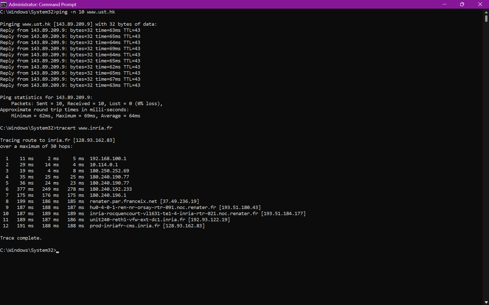

# **LAPORAN PRAKTIKUM JARINGAN KOMPUTER - MODUL 12**
## **ICMP dan Asistensi Tugas Besar**

### **Identitas Mahasiswa**
**Nama:** Albertio Suranta Ginting  
**NIM:** 103072400128  
**Kelas:** IF - 04 - 01

---

## A. Tujuan Praktikum
1. Menginvestigasi cara kerja protokol ICMP menggunakan Wireshark.
2. Membuat program ICMP Pinger.
3. Asistensi dan laporan progress pengerjaan tugas besar.

---

## B. Langkah Praktikum
### 1. Pengujian ICMP via Ping
1. Buka **Command Prompt**.
2. Jalankan aplikasi **Wireshark**, lalu mulai proses perekaman (*packet capture*) pada kartu jaringan yang terhubung ke internet.
3. Eksekusi perintah *ping* yang ditujukan ke server lintas benua dengan membatasi jumlah paket sebanyak 10:
   `ping -n 10 www.ust.hk`
4. Biarkan proses berjalan hingga sistem selesai mengirim dan menerima ke-10 paket tersebut.
5. Hentikan perekaman data di Wireshark.
6. Ketikkan `icmp` pada kolom *display filter* untuk membuang paket selain ICMP.
7. Lakukan observasi pada struktur *header* untuk paket *Echo Request* maupun *Echo Reply*.

### 2. Pengujian ICMP via Traceroute
1. Jalankan kembali **Command Prompt** dan mulai ulang perekaman di **Wireshark**.
2. Ketikkan perintah pelacakan rute (*traceroute*) menuju server di Eropa:
   `tracert www.inria.fr`
3. Tunggu sistem menelusuri setiap *hop* hingga mencapai titik tujuan akhir.
4. Hentikan perekaman Wireshark dan terapkan kembali filter `icmp`.
5. Amati kemunculan paket *Time Exceeded* dan *Echo Reply* dari proses tersebut.

---

## C. Hasil dan Pembahasan

### 1. Output CMD - Ping
Berikut adalah respons terminal saat perintah `ping -n 10 www.ust.hk` dieksekusi:

*Gambar 1: Tangkapan layar Command Prompt untuk uji konektivitas ke www.ust.hk.*

Berdasarkan *output* di atas, diperoleh informasi teknis:
| Indikator | Nilai Pengukuran | Interpretasi Hasil |
| :--- | :---: | :--- |
| **Data Terkirim (*Sent*)** | 10 Paket | OS sukses mentransmisikan seluruh *Echo Request* ke jaringan. |
| **Data Diterima (*Received*)** | 10 Paket | *Server* di Hong Kong merespons kembali setiap paket secara utuh. |
| **Tingkat Kehilangan (*Loss*)** | **0%** | Stabilitas jalur internasional berada dalam kondisi prima tanpa hambatan (*drop*). |
| **Waktu Rata-rata (*Avg RTT*)** | **64 ms** | Latensi yang sangat responsif untuk ukuran komunikasi antar-negara. |
| **Latensi Tercepat (*Min RTT*)** | **52 ms** | Titik optimal waktu tempuh pulang-pergi. |
| **Latensi Terlama (*Max RTT*)** | **69 ms** | Titik maksimal waktu tempuh (masih dalam batas sangat wajar). |
| **Sisa Usia Paket (*TTL*)** | **43** | Dengan asumsi TTL *default* Windows adalah 128, paket diperkirakan telah melintasi **85 router/hop** (dihitung dari 128 - 43). |

### 2. Analisis Paket ICMP Ping di Wireshark
Setelah penyaringan, Wireshark menangkap tepat 20 paket ICMP (terdiri dari 10 paket permintaan dan 10 paket balasan).

*Gambar 2: Isolasi paket ICMP hasil perintah ping pada Wireshark.*

#### Karakteristik Paket Echo Request (Klien ke Server)
| Parameter Header | Nilai Terbaca | Penjelasan Tipe Paket |
|-------|-------|-----------|
| **Type** | **8** | Menandakan paket adalah *Echo Request* |
| **Code** | **0** | Format standar request |
| **Checksum** | **0x4d50** | Verifikasi integritas data (*Good/Correct*) |
| **Sequence Number** | **11 (0x000b)** | Menunjukkan urutan transmisi (paket ke-11) |
| **Data Length** | **32 bytes** | Berisi *payload* karakter *dummy* (contoh: "abcdefghi...") |

#### Karakteristik Paket Echo Reply (Server ke Klien)

*Gambar 4: Pembedahan lapisan header ICMP Echo Reply.*

| Parameter Header | Nilai Terbaca | Penjelasan Tipe Paket |
|-------|-------|-----------|
| **Type** | **0** | Menandakan respons balik (*Echo Reply*) |
| **Code** | **0** | Format standar balasan |
| **Checksum** | **0x5550** | Verifikasi integritas data (*Good/Correct*) |
| **Sequence Number** | **11 (0x000b)** | Dicocokkan dengan *Sequence Number* pada *Request* |

**Analisis Paket di Wireshark:**
Alur komunikasi bekerja secara sekuensial (tanya-jawab). IP sumber `192.168.100.31` (komputer lokal) mengirimkan Tipe 8, lalu IP target `143.89.209.9` (`www.ust.hk`) membalas secara konsisten dengan Tipe 0. Tidak ditemukan indikasi putus paket pada *frame* 425 hingga 598.

### 3. Output CMD - Traceroute
Tangkapan layar di bawah memperlihatkan proses pelacakan menuju `www.inria.fr`:

*Gambar 5: Tangkapan layar Command Prompt untuk pelacakan rute (tracert) ke www.inria.fr.*

Rincian pemetaan jalurnya adalah:
| Indikator Pelacakan | Temuan Data | Analisis Mekanisme |
| :--- | :--- | :--- |
| **Jumlah *Hop* (Lompatan)** | **12 hops** | Dibutuhkan 11 rute perantara untuk akhirnya bersandar di *server* target pada *hop* ke-12. |
| **Jumlah Probe per *Hop*** | **3 kali uji** | Utilitas mengirimkan tiga paket pada setiap tingkat TTL untuk mengukur variasi latensi di titik yang sama. |
| **Respons *Router* Perantara** | **Time Exceeded** (Tipe 11, Kode 0) | *Router* di tengah jalan menolak meneruskan paket karena jatah TTL-nya sengaja dihabiskan menjadi 0 oleh sistem klien. |
| **Tujuan Akhir (Hop 12)** | `128.93.162.83` | Setelah TTL cukup untuk mencapai tujuan, *server* akhir membalas menggunakan *Echo Reply* (Tipe 0, Kode 0). |

**Rangkuman Topologi Rute yang Dilalui:**
1. Keluar dari *Gateway* lokal (192.168.100.1).
2. Memasuki infrastruktur ISP domestik Indonesia (segmen 10.x.x.x dan 180.x.x.x).
3. Melompat ke gerbang internasional RENATER di Prancis (37.49.236.19 dan 193.51.180.43).
4. Masuk ke jaringan privat INRIA dan berlabuh di *server* `128.93.162.83`.

### 4. Analisis Paket ICMP Traceroute di Wireshark

*Gambar 6: Tampilan paket ICMP Time Exceeded akibat manipulasi TTL pada traceroute.*

#### Karakteristik Paket Time Exceeded (Tipe 11, Kode 0)

*Gambar 7: Pembedahan lapisan paket ICMP Time Exceeded.*

| Parameter Header | Nilai Terbaca | Fungsi Spesifik |
|-------|-------|-----------|
| **Type** | **11** | Menginformasikan status *Time Exceeded* |
| **Code** | **0** | *TTL expired in transit* (Habis masa berlaku di tengah jalan) |
| **Isi Payload Khusus** | **Original IP Header** | Menyertakan salinan *header* dari paket asli yang gagal dikirim. |

**Analisis Paket Traceroute di Wireshark:**
Untuk memudahkan diagnostik, paket *Time Exceeded* selalu menyelipkan informasi paket penyebab *error*. Dalam observasi ini, paket memuat data bahwa paket aslinya memiliki *Source* `192.168.100.31`, *Destination* `128.93.162.83`, dan diset dengan nilai awal **TTL = 1**. Inilah yang memaksa *router* pertama untuk langsung merespons dengan *error* Tipe 11.

---

## D. Analisis Komparatif dan Kesimpulan

### 1. Perbandingan Teknis: Ping vs Traceroute

| Aspek Penilaian | Karakteristik ICMP *Ping* | Karakteristik ICMP *Traceroute* |
| :--- | :--- | :--- |
| **Perilaku *Header* Type** | Dominan menggunakan kombinasi absolut: `Type 8` (*Request*) dan `Type 0` (*Reply*). | Mengeksploitasi pesan *error* `Type 11` (*Time Exceeded*) dari perangkat *router*. |
| **Manipulasi Parameter TTL** | Memakai nilai mutlak bawaan sistem (contoh: statis di angka 128). | Memanipulasi angka TTL agar naik bertahap secara inkremental (1, 2, 3, ...). |
| **Fokus Pengujian** | Memeriksa stabilitas koneksi ujung-ke-ujung (*end-to-end*). | Membedah dan mengidentifikasi IP *router* penyusun topologi jaringan di sepanjang jalur komunikasi. |

### 2. Analisis Kuantitatif Performa Jaringan

- **Pada Skenario *Ping* (Hong Kong):** Performanya tergolong unggul dengan tingkat latensi rata-rata hanya 64 ms tanpa *packet loss*. Hasil perhitungan sisa TTL (128 - 43 = 85) menjadi indikator valid bahwa jarak logis antar-simpul cukup panjang namun ditangani oleh medium transmisi berkecepatan tinggi.
- **Pada Skenario *Traceroute* (Prancis):** Dapat dipetakan secara presisi ada 12 titik simpul (*hop*) yang menjembatani jaringan lokal dengan *server* Eropa tersebut. Tingginya latensi di beberapa *hop* merupakan fenomena wajar (*bottleneck* lintas samudra) yang diidentifikasi dari lambatnya balasan paket `Type 11` dari *router* internasional.

---