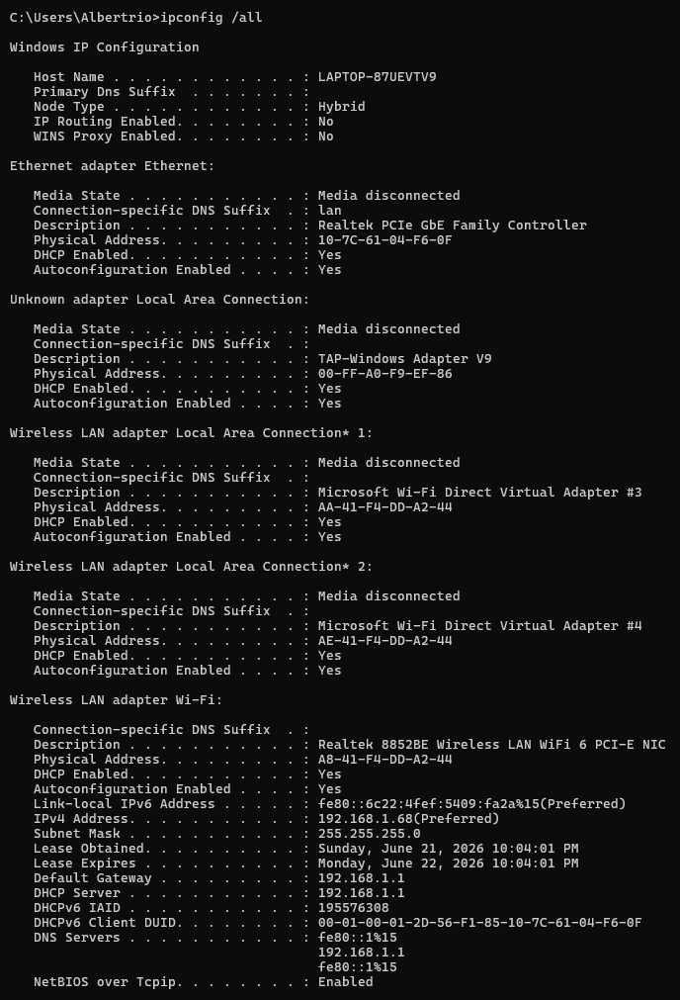
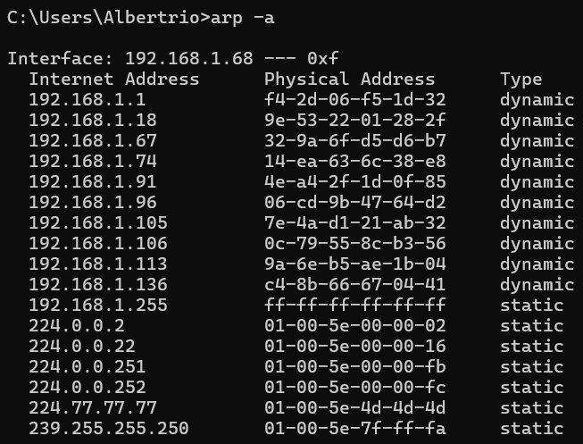
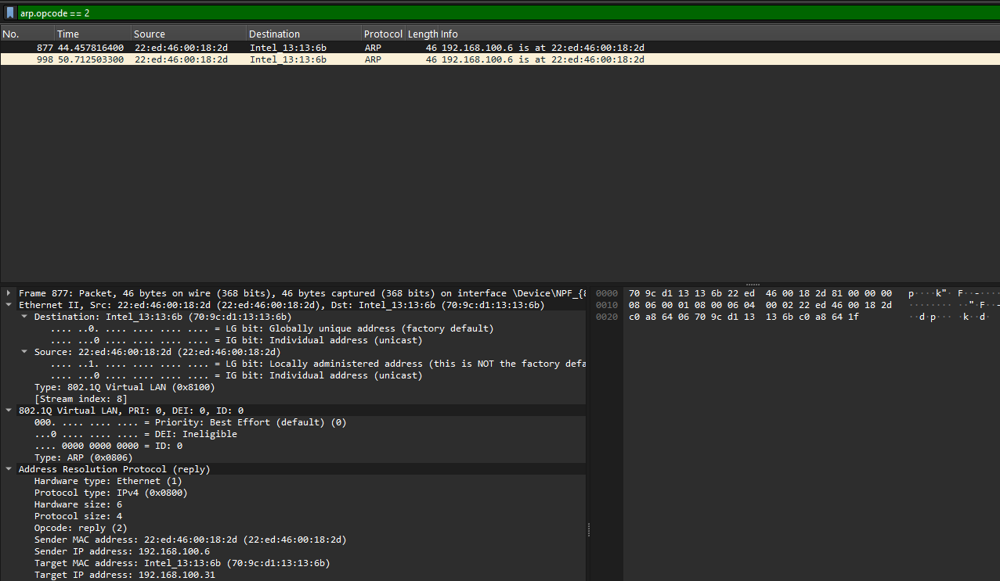
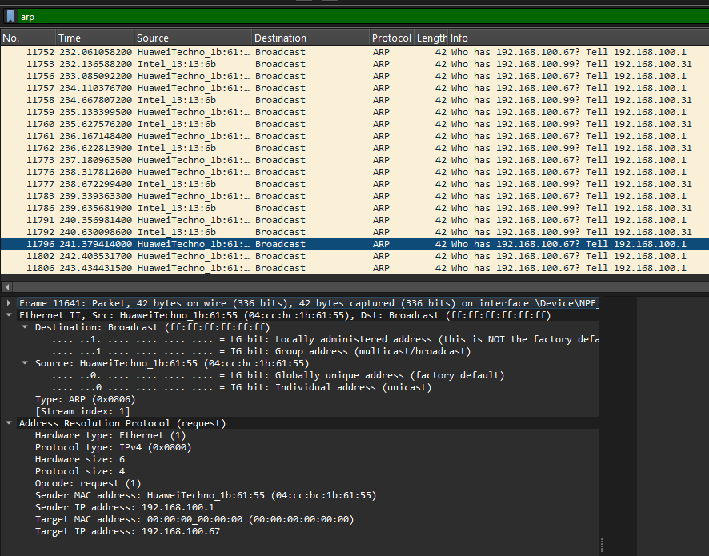
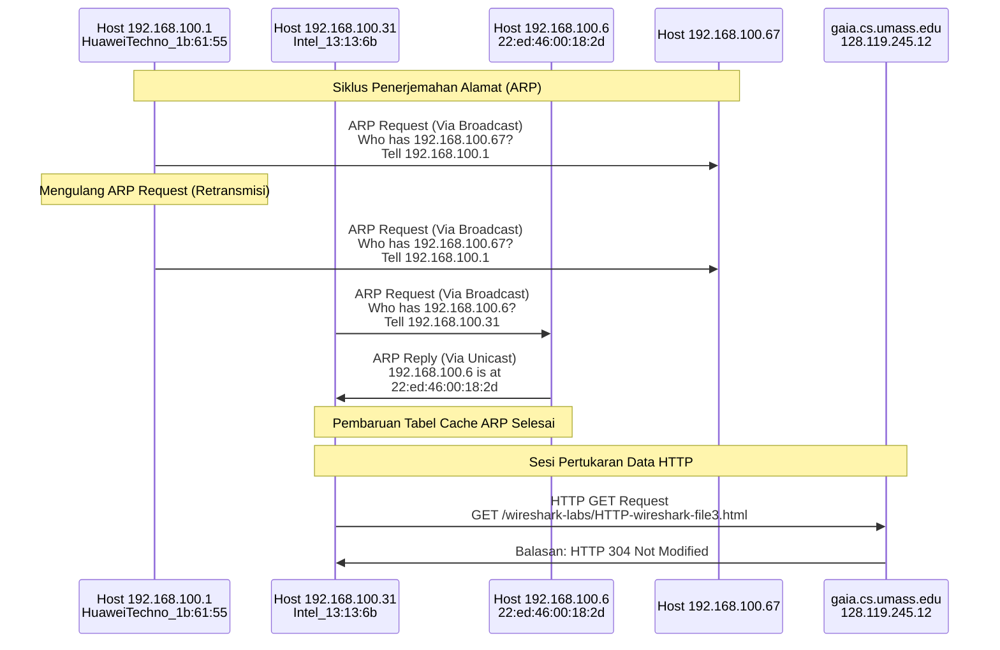

# **LAPORAN PRAKTIKUM JARINGAN KOMPUTER - MODUL 13**
## **Ethernet and ARP**

### **Identitas Mahasiswa**
**Nama:** Albertio Suranta Ginting  
**NIM:** 103072400128  
**Kelas:** IF - 04 - 01

---

## A. Tujuan Praktikum
1. Menginvestigasi cara kerja Ethernet dan ARP menggunakan Wireshark.

---

## B. Langkah Praktikum
### 1. Perekaman Frame Ethernet
1. Membersihkan data *cache* pada browser (ctrl + shift + del).
2. Jalankan Wireshark dan mulai perekaman paket jaringan (*packet capture*).
3. Membuka tautan: `http://gaia.cs.umass.edu/wireshark-labs/HTTP-ethereal-lab-file3.html`.
4. Pastikan browser berhasil memuat halaman berisi teks "Bill of Rights AS".
5. Hentikan proses perekaman di Wireshark untuk selanjutnya dilakukan pembedahan *frame* Ethernet.

### 2. Analisis ARP Cache
1. Membuka *Command Prompt* pada sistem operasi Windows.
2. Mengetikkan perintah `arp -a` untuk menampilkan daftar *cache* ARP.
3. Membedakan entri jaringan yang bersifat dinamis (*dynamic*) dan statis (*static*).
4. Mengonfirmasi antarmuka jaringan (*network interface*) mana yang sedang beroperasi.

### 3. Mengamati Aksi ARP
1. Menghapus seluruh data *cache* pada sistem ARP maupun peramban web.
2. Memulai kembali perekaman paket data melalui Wireshark.
3. Mengakses ulang URL yang sama seperti langkah sebelumnya.
4. Mengobservasi paket *ARP Request* dan balasannya berupa *ARP Reply*.
5. Mengaplikasikan filter `arp.opcode == 2` guna menyortir paket balasan (*Reply*).
6. Mengaplikasikan filter `arp` secara umum untuk meninjau seluruh aktivitas protokol tersebut.

---

## C. Hasil dan Pembahasan

### 1. Identifikasi Network Interface

  
*Gambar 1: Tangkapan layar hasil perintah ipconfig /all*

### 2. Pemantauan Tabel Cache ARP

  
*Gambar 2: Tangkapan layar dari tabel cache ARP hasil eksekusi perintah arp -a*

**Interpretasi Data:**
Kategori entri **Dynamic** merujuk pada alamat yang direkam secara mandiri oleh sistem setelah terjadi proses komunikasi ARP (contoh: IP Gateway 192.168.1.67). Sebaliknya, entri **Static** adalah alamat yang ditanamkan secara permanen oleh sistem operasi, umumnya difungsikan untuk kebutuhan transmisi *broadcast* dan *multicast*.

### 3. Analisis ARP Reply ARP Reply

  
*Gambar 3: Ekstraksi paket balasan ARP (Terekam pada Frame 877)*

#### Anatomi ARP Reply (Frame 877)

| Komponen Field | Nilai Terbaca | Penjelasan Singkat |
|-------|-------|-----------|
| **Frame Number** | 877 | Urutan paket di Wireshark |
| **Time** | 44.457816400 detik | Stempel waktu perekaman |
| **Source MAC** | 22:ed:46:00:18:2d | Alamat fisik perangkat pengirim balasan |
| **Destination MAC** | Intel_13:13:6b (70:9c:d1:13:13:6b) | Alamat fisik perangkat penanya |
| **Type** | 802.1Q Virtual LAN (0x8100) | Menandakan adanya pelabelan VLAN |
| **Protocol** | ARP (0x0806) | Tipe protokol komunikasi |
| **Hardware Type** | Ethernet (1) | Media transmisi yang digunakan |
| **Protocol Type** | IPv4 (0x0800) | Jenis alamat logika |
| **Opcode** | reply (2) | Identifikasi sebagai paket balasan |
| **Sender MAC** | 22:ed:46:00:18:2d | MAC target yang berhasil ditemukan |
| **Sender IP** | 192.168.100.6 | IP target yang merespons |
| **Target MAC** | 70:9c:d1:13:13:6b | MAC klien yang menanyakan |
| **Target IP** | 192.168.100.31 | IP klien yang menanyakan |

#### Detail Header Ethernet

```text
Ethernet II, Src: 22:ed:46:00:18:2d (22:ed:46:00:18:2d), Dst: Intel_13:13:6b (70:9c:d1:13:13:6b)
    Destination: Intel_13:13:6b (70:9c:d1:13:13:6b)
        .... ..0. .... .... .... .... = LG bit: Globally unique address (factory default)
        .... ...0 .... .... .... .... = IG bit: Individual address (unicast)
    Source: 22:ed:46:00:18:2d (22:ed:46:00:18:2d)
        .... ..0. .... .... .... .... = LG bit: Locally administered address (this is NOT the factory default)
        .... ...0 .... .... .... .... = IG bit: Individual address (unicast)
    Type: 802.1Q Virtual LAN (0x8100)
        [Stream index: 8]
    802.1Q Virtual LAN, PRI: 0, DEI: 0, ID: 0
        000. .... .... .... = Priority: Best Effort (default) (0)
        ...0 .... .... .... = DEI: Ineligible
        .... 0000 0000 0000 = ID: 0
    Type: ARP (0x0806)
```

**Interpretasi Data:**
Berbeda dengan *request*, paket balasan ini ditransmisikan secara tertutup (*unicast*) khusus kepada host yang bertanya. Host sumber (192.168.100.6) menyerahkan identitas MAC-nya (22:ed:46:00:18:2d) langsung kepada klien (192.168.100.31). Komunikasi ini disisipi fitur *tagging VLAN 802.1Q*, dan MAC sumbernya tercatat menggunakan format *locally administered address*.

### 4. Analisis ARP Request

  
*Gambar 4: Identifikasi paket permintaan ARP (Terekam pada Frame 11641)*

#### Struktur ARP Request (Frame 11641)

| Komponen Field | Nilai Terbaca | Penjelasan Singkat |
|-------|-------|-----------|
| **Frame Number** | 11641 | Urutan paket di Wireshark |
| **Source MAC** | HuaweiTechno_1b:61:55 (04:cc:bc:1b:61:55) | Pengirim pesan pencarian |
| **Destination** | Broadcast (ff:ff:ff:ff:ff:ff) | Diteriakkan ke seluruh host |
| **Type** | ARP (0x0806) | Tipe protokol |
| **Hardware Type** | Ethernet (1) | Media komunikasi |
| **Protocol Type** | IPv4 (0x0800) | Tipe alamat tujuan |
| **Opcode** | request (1) | Identifikasi sebagai paket permintaan |
| **Sender MAC** | 04:cc:bc:1b:61:55 | MAC perangkat penanya |
| **Sender IP** | 192.168.100.1 | IP perangkat penanya |
| **Target MAC** | 00:00:00:00:00:00 | Sengaja dikosongkan (belum diketahui) |
| **Target IP** | 192.168.100.67 | IP target yang dicari MAC-nya |

#### Detail Keseluruhan Paket

```text
Ethernet II, Src: HuaweiTechno_1b:61:55 (04:cc:bc:1b:61:55), Dst: Broadcast (ff:ff:ff:ff:ff:ff)
    Destination: Broadcast (ff:ff:ff:ff:ff:ff)
        .... ..1. .... .... .... .... = LG bit: Locally administered address (this is NOT the factory default)
        .... ..11 .... .... .... .... = IG bit: Group address (multicast/broadcast)
    Source: HuaweiTechno_1b:61:55 (04:cc:bc:1b:61:55)
        .... ..0. .... .... .... .... = LG bit: Globally unique address (factory default)
        .... ...0 .... .... .... .... = IG bit: Individual address (unicast)
    Type: ARP (0x0806)
    [Stream index: 1]

Address Resolution Protocol (request)
    Hardware type: Ethernet (1)
    Protocol type: IPv4 (0x0800)
    Hardware size: 6
    Protocol size: 4
    Opcode: request (1)
    Sender MAC address: HuaweiTechno_1b:61:55 (04:cc:bc:1b:61:55)
    Sender IP address: 192.168.100.1
    Target MAC address: 00:00:00:00:00:00 (00:00:00:00:00:00)
    Target IP address: 192.168.100.67
```

**Interpretasi Data:**
Proses pencarian MAC address mengharuskan klien mengirim pesan massal (*broadcast*). Dalam skenario ini, host `192.168.100.1` memancarkan sinyal ke seluruh jaringan untuk menanyakan, "Siapakah pemilik IP 192.168.100.67?". Kolom MAC tujuan dibiarkan bernilai nol (`00:00:00:00:00:00`). Hanya perangkat yang benar-benar memiliki IP `192.168.100.67` yang berhak memberikan respons balik.

#### Traffic Pattern ARP Request

| Frame | Sumber Pengirim | Target Tujuan | Informasi Pesan |
|-----------|--------|-------------|------|
| 11752 | HuaweiTechno_1b:61:55 | Broadcast | Who has 192.168.100.67? Tell 192.168.100.1 |
| 11753 | Intel_13:13:6b | Broadcast | Who has 192.168.100.99? Tell 192.168.100.31 |
| 11756 | HuaweiTechno_1b:61:55 | Broadcast | Who has 192.168.100.67? Tell 192.168.100.1 |
| 11757 | HuaweiTechno_1b:61:55 | Broadcast | Who has 192.168.100.67? Tell 192.168.100.1 |
| 11758 | Intel_13:13:6b | Broadcast | Who has 192.168.100.99? Tell 192.168.100.31 |

**Analisis Pattern:**
Terpantau adanya pengulangan pengiriman (*retransmission*) karena tidak ada respons instan. Terdapat dua entitas berbeda yang sedang aktif melempar kueri ARP ke jaringan, yaitu IP `192.168.100.1` (mencari `192.168.100.67`) dan IP `192.168.100.31` (mencari `192.168.100.99`).

### 5. Analisis HTTP over Ethernet

  
*Gambar 5: Ekstraksi paket HTTP GET Request (Terekam pada Frame 126)*

#### Informasi Paket HTTP

| Nama Field | Data Teknis |
|-------|-------|
| **Frame Number** | 126 |
| **Waktu Perekaman** | 14.560988700 detik |
| **IP Pengirim** | 192.168.100.31 |
| **IP Tujuan** | 128.119.245.12 (gaia.cs.umass.edu) |
| **MAC Pengirim** | Intel_13:13:6b (70:9c:d1:13:13:6b) |
| **MAC Tujuan (Gateway)** | HuaweiTechno_1b:61:55 (04:cc:bc:1b:61:55) |
| **Protokol** | HTTP |
| **Bentuk Permintaan** | GET /wireshark-labs/HTTP-wireshark-file3.html HTTP/1.1 |
| **Kode Respons** | HTTP/1.1 304 Not Modified |

#### Stack Protokol

```text
Frame 126: 653 bytes on wire (5224 bits), 653 bytes captured (5224 bits)
├─ Ethernet II (Layer 2)
│  ├─ Destination: HuaweiTechno_1b:61:55 (04:cc:bc:1b:61:55)
│  ├─ Source: Intel_13:13:6b (70:9c:d1:13:13:6b)
│  └─ Type: IPv4 (0x0800)
├─ Internet Protocol Version 4 (Layer 3)
│  ├─ Version: 4
│  ├─ Header Length: 20 bytes (5)
│  ├─ Differentiated Services Field: 0x00 (DSCP: CS0, ECN: Not-ECT)
│  ├─ Total Length: 639
│  ├─ Identification: 0x1143 (4419)
│  ├─ Flags: 0x2, Don't fragment
│  ├─ Time to Live: 128
│  ├─ Protocol: TCP (6)
│  ├─ Source Address: 192.168.100.31
│  └─ Destination Address: 128.119.245.12
├─ Transmission Control Protocol (Layer 4)
│  ├─ Source Port: 53475
│  ├─ Destination Port: 80 (HTTP)
│  ├─ Seq: 1, Ack: 1, Len: 599
│  └─ [Stream index: 21]
└─ Hypertext Transfer Protocol (Layer 7)
   ├─ GET /wireshark-labs/HTTP-wireshark-file3.html HTTP/1.1
   ├─ Host: gaia.cs.umass.edu
   └─ [Response: HTTP/1.1 304 Not Modified]
```

**Interpretasi Data:**
Sesi ini menangkap *request* dari IP klien (192.168.100.31) yang diarahkan ke peladen web eksternal (128.119.245.12). Menariknya, peladen mengembalikan status `304 Not Modified`, mengindikasikan bahwa peramban tidak perlu mengunduh ulang dokumen karena tidak ada pembaruan isi sejak akses terakhir. Paket memiliki beban muatan (*payload*) 599 *byte*, memanfaatkan port asal TCP 53475 menuju port 80, serta dibekali batas usia (*TTL*) 128 lompatan.

### 6. Perbandingan Identitas ARP Request vs ARP Reply

| Parameter Pembanding | Kondisi pada ARP Request | Kondisi pada ARP Reply |
|-------|-------------|-----------|
| **Kode Operasi (Opcode)** | Bernilai 1 (Sifatnya Bertanya) | Bernilai 2 (Sifatnya Menjawab) |
| **Alamat MAC Tujuan** | ff:ff:ff:ff:ff:ff (*Broadcast*) | Spesifik menuju alamat penanya (*Unicast*) |
| **Kolom Target MAC** | 00:00:00:00:00:00 (Dikosongkan) | Disi dengan MAC perangkat yang merespons |
| **Metode Distribusi** | Menjangkau semua perangkat (Satu ke banyak) | Transmisi tertutup (*Point-to-point*) |
| **Misi Utama** | Melacak kepemilikan sebuah alamat IP | Menyetorkan informasi alamat MAC yang sah |

### 7. Visualisasi Traffic Pattern



### 8. Struktur Blok Frame Ethernet

#### Skema Ethernet Frame dengan Ekstensi VLAN (802.1Q)

```text
+------------------+------------------+------------------+
| Dest MAC         | Source MAC       | Type             |
| (6 bytes)        | (6 bytes)        | 0x8100 (802.1Q)  |
+------------------+------------------+------------------+
| 802.1Q Tag (Tambahan 4 bytes)                          |
| Prioritas: 0, DEI: 0, ID VLAN: 0                       |
+------------------+------------------+------------------+
| EtherType Asli: 0x0806 (ARP) atau 0x0800 (IPv4)        |
+------------------+------------------+------------------+
| Beban Data / Payload (46 hingga 1500 bytes)            |
+------------------+------------------+------------------+
| Frame Check Sequence (FCS) untuk Error Checking        |
| (4 bytes)                                              |
+------------------+------------------+------------------+
```

---

## D. Kesimpulan

Berdasarkan praktikum yang telah dilakukan, didapatkan kesimpulan:

1. **Konfigurasi Network Interface:** Komputer praktikan beroperasi melalui modul WiFi (Realtek RTL8852BE) dengan alamat fisik `24-B2-B9-78-54-53`, mengamankan IP logis `10.218.15.39` (/20), serta berada di bawah kendali *Gateway* dan DHCP `10.218.0.253`.
2. **Karakteristik Penyimpanan ARP:** Sistem *cache* secara otomatis mencatat rute IP yang baru diajak berkomunikasi (*dynamic*), sekaligus memelihara rute statis wajib untuk mengakomodasi lalu lintas *broadcast/multicast*.
3. **Pola Transmisi ARP:** Kueri pencarian alamat (*Request*) dieksekusi secara membabi buta ke semua perangkat (*broadcast*) dengan menyamarkan Target MAC sebagai `00:00:00:00:00:00`. Sebagai serangan balasan, konfirmasi identitas (*Reply*) hanya diberikan secara eksklusif kepada perangkat penanya (*unicast*).
4. **Implementasi VLAN:** Terdeteksi adanya manipulasi panjang *frame* akibat penyisipan protokol VLAN (802.1Q). Terdapat injeksi ukuran sebesar 4 *byte* tambahan pada *header* untuk mengakomodir identitas ID VLAN maupun skala prioritas lalu lintas.
5. **Konsep Matryoshka Jaringan (Enkapsulasi):** Terlihat jelas bahwa data mentah HTTP dimasukkan ke peti TCP, yang kemudian dibungkus kardus IP, lalu diangkut oleh kontainer Ethernet. Peramban juga cerdas memanfaatkan sistem validasi *cache* (kode HTTP 304) untuk meminimalisir pemborosan *bandwidth*.
6. **Representasi Bit MAC Address:** Sistem mengenali kodrat sebuah MAC Address dari pengaturan bit-nya, di mana nilai parameter *Individual/Group (IG)* menentukan apakah sinyal diarahkan ke satu titik atau massal, dan parameter *Local/Global (LG)* membedakan MAC bawaan pabrik dengan MAC hasil modifikasi perangkat lunak.

---
