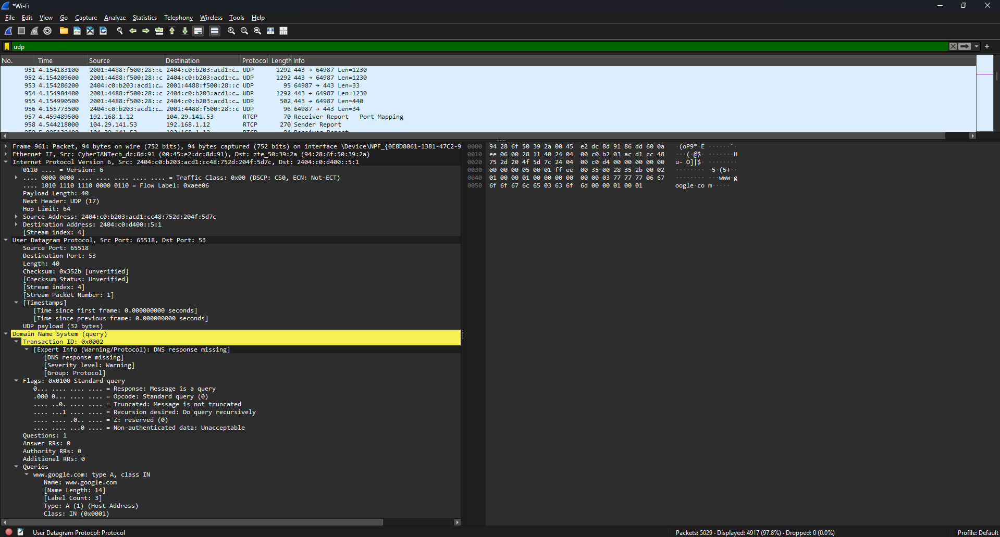

# **LAPORAN PRAKTIKUM JARINGAN KOMPUTER - MODUL 5**
## **UDP**

### **Identitas Mahasiswa**
**Nama:** Albertio Suranta Ginting  
**NIM:** 103072400128  
**Kelas:** IF - 04 - 01

---

## A. Tujuan Praktikum
1. Menginvestigasi cara kerja protokol UDP menggunakan Wireshark

---

## B. Dasar Teori
### 1. Konsep Dasar User Datagram Protocol (UDP)
UDP merupakan salah satu standar protokol pengiriman data yang tidak berbasis koneksi (connectionless). Ketiadaan proses inisiasi koneksi sebelum data dikirimkan membuat UDP terbebas dari beban pemrosesan (overhead) yang besar, menjadikannya sangat ringan dan cepat.
Beberapa sifat utama UDP meliputi:
- Beroperasi secara connectionless.
- Menerapkan best-effort delivery (tidak ada garansi data pasti sampai).
- Tidak menyediakan mekanisme pengiriman ulang (retransmission) jika ada paket yang drop.
- Memiliki header yang sangat kecil, yakni hanya 8 byte.
- Sangat optimal untuk kebutuhan transmisi data real-time.
### 2. Arsitektur Header UDP
Sebuah *header* UDP disusun oleh empat komponen (*field*) utama, yaitu:

| Komponen Field | Ukuran |
|---|---|
| Source Port | 2 Byte |
| Destination Port | 2 Byte |
| Length | 2 Byte |
| Checksum | 2 Byte |

Secara keseluruhan, panjang total dari *header* UDP adalah tetap sebesar 8 *byte*.

## 3 Perangkat Analisis Wireshark

Wireshark adalah kakas penangkap dan penganalisis protokol jaringan (*network protocol analyzer*) yang berfungsi untuk menyadap, merekam, dan membedah detail paket data yang sedang berseliweran di dalam suatu antarmuka jaringan komputer.

---

## C METODOLOGI PRAKTIKUM

### 1 Kebutuhan Perangkat

* Unit Komputer/Laptop
* Sistem Operasi Windows
* Aplikasi Wireshark
* Jaringan Internet yang aktif

### 2 Prosedur Percobaan

1.  Jalankan program Wireshark pada perangkat.
2.  Tentukan dan pilih antarmuka jaringan (*network interface*) yang sedang terhubung ke internet.
3.  Mulai proses perekaman data (*packet capture*).
4.  Buka utilitas Command Prompt (CMD).
5.  Eksekusi baris perintah di bawah ini untuk memicu *query* DNS:
    `nslookup www.google.com`
6.  Hentikan proses *capture* pada Wireshark.
7.  Ketikkan parameter berikut pada kolom *display filter*:
    `udp`
8.  Pilih dan klik salah satu baris paket UDP yang relevan.
9.  Lakukan inspeksi terhadap rincian *header* UDP pada panel detail paket.

---

## D. HASIL DAN PEMBAHASAN

### 1 Hasil Capture Paket UDP

Berdasarkan *packet capture* yang telah dieksekusi, Wireshark berhasil merekam paket UDP yang bersumber dari aktivitas DNS Query yang menargetkan domain `www.google.com`. Implementasi *filter* `udp` secara efektif menyaring dan hanya menampilkan lalu lintas berbasis UDP selama rentang waktu perekaman.

#### Hasil Tangkapan Paket UDP di Wireshark

### 2. Analisis Komponen Header UDP

Dari hasil ekstraksi data paket menggunakan Wireshark, didapatkan rincian nilai *header* sebagai berikut:

| Nama Field | Nilai Terbaca |
|---|---|
| Source Port | 65518 |
| Destination Port | 53 |
| Length | 40 |
| Checksum | 0x352b |
| Ukuran Payload | 32 Byte |

### 3 Pembahasan Pertanyaan Modul

#### a. Berapa banyak field yang terdapat pada header UDP? Sebutkan nama-namanya.

Berdasarkan inspeksi arsitektur paket, *header* UDP secara konsisten disusun oleh 4 *field*, antara lain:
1.  Source Port
2.  Destination Port
3.  Length
4.  Checksum

---

#### b. Berapa panjang masing-masing field yang terdapat pada header UDP?

Setiap *field* menyumbang ukuran yang identik:

| Nama Field | Alokasi Ukuran |
|---|---|
| Source Port | 2 Byte |
| Destination Port | 2 Byte |
| Length | 2 Byte |
| Checksum | 2 Byte |

Total ukuran *header* dihitung sebagai berikut:
`Total = 2 + 2 + 2 + 2 = 8 Byte`

---

#### c. Nilai yang tertera pada field Length menyatakan nilai apa?

*Field Length* berfungsi sebagai penunjuk ukuran keseluruhan dari sebuah segmen UDP. Nilai ini merupakan akumulasi dari besaran *header* UDP beserta besaran datanya (*payload*).

Berdasarkan data tangkapan:
`Length Total = 40 Byte`

Karena ukuran *header* mutlak 8 *byte*, maka perhitungan *payload* dilakukan dengan persamaan:
`Payload = Length Total - Header UDP`
`Payload = 40 - 8`
`Payload = 32 Byte`

Perhitungan matematis ini sejalan dengan rincian Wireshark yang menginformasikan bahwa ukuran data (*UDP payload*) adalah sebesar 32 *byte*.

---

#### d. Berapa jumlah maksimum byte yang dapat disertakan dalam payload UDP?

Dikarenakan *field Length* dialokasikan sebesar 16 *bit*, nilai desimal terbesar yang bisa ditampung adalah:
`Nilai Maksimum = 65535 Byte`

Dengan memperhitungkan ruang yang wajib digunakan oleh *header* (8 *byte*), maka sisa ruang maksimal untuk *payload* adalah:
`Maksimum Payload = 65535 - 8 = 65527 Byte`

Dengan demikian, ukuran maksimal data (*payload*) yang mampu diangkut oleh satu segmen UDP adalah **65527 byte**.

---

#### e. Berapa nomor port terbesar yang dapat menjadi port sumber?

Sama seperti parameter *Length*, *field Source Port* juga direpresentasikan dengan panjang 16 *bit*. Hal ini memungkinkan port untuk menggunakan nilai hingga rentang maksimum:
`2^16 - 1 = 65535`

Oleh karena itu, angka port paling tinggi yang diizinkan beroperasi sebagai port sumber adalah **65535**.

---

#### f. Berapa nomor protokol UDP?

Jika ditinjau dari informasi yang disematkan pada lapisan *header* IP (*Next Header*), protokol UDP direpresentasikan dengan kode:

| Format Bilangan | Nilai |
|---|---|
| Desimal | 17 |
| Heksadesimal | 0x11 |

---

#### g. Jelaskan hubungan antara nomor port pada kedua paket tersebut!

Dalam skenario *query* DNS berbasis UDP, komputer klien (pengirim *request*) akan menetapkan *Source Port* secara acak (dinamis) dan mengirimkannya menuju server dengan *Destination Port* absolut bernilai 53. 

Saat server DNS merespons balik ke klien, server akan melakukan *swap* (pertukaran) posisi nilai port.

**Simulasi pada Paket Request:**
`Source Port      = 65518`
`Destination Port = 53`

**Simulasi pada Paket Response:**
`Source Port      = 53`
`Destination Port = 65518`

Singkatnya, *Source Port* milik klien saat *request* akan diadopsi menjadi *Destination Port* oleh server saat membalas. Sebaliknya, *Destination Port* (53) saat *request* akan berubah menjadi *Source Port* server dalam proses *response*.

---

## E. KESIMPULAN

Dari seluruh rangkaian percobaan ini, dapat ditarik kesimpulan bahwa UDP adalah protokol *transport layer* berkarakteristik *connectionless* yang mengedepankan efisiensi melalui penggunaan *header* kecil berukuran 8 *byte*. Struktur *header* ini dibangun atas empat parameter utama: *Source Port, Destination Port, Length,* dan *Checksum*. Melalui penyadapan lalu lintas jaringan menggunakan Wireshark, terbukti bahwa proses *query* DNS ke `www.google.com` memanfaatkan UDP, tercatat dengan *Source Port* 65518 dan *Destination Port* 53, serta menampung muatan total 40 *byte* (*payload* aktual 32 *byte*). Analisis ini membuktikan secara empiris mekanisme kerja serta struktur pertukaran port UDP dalam komunikasi jaringan komputer *real-time*.

---