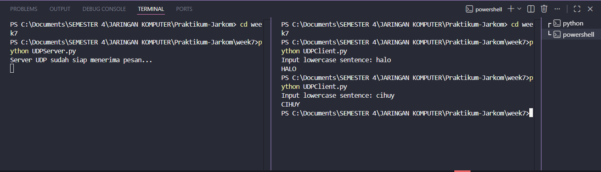

# **LAPORAN PRAKTIKUM JARINGAN KOMPUTER - MODUL 7**
## **SOCKET PROGRAMMING: MEMBUAT APLIKASI JARINGAN**

### **Identitas Mahasiswa**
**Nama:** Albertio Suranta Ginting  
**NIM:** 103072400128  
**Kelas:** IF - 04 - 01

---

## A. Tujuan Praktikum
1. Membuat program berbasis socket UDP
2. Membuat program berbasis socket TCP

---

## B. Dasar Teori
### 1. Konsep Socket Programming
| Istilah | Penjelasan |
|---------|----------|
| **Socket** | Titik akhir (*endpoint*) dari sebuah tautan komunikasi jaringan antar program. |
| **Client** | Entitas atau program yang bertugas menginisiasi koneksi atau mengirimkan *request*. |
| **Server** | Program yang berstatus siaga (*listening*) untuk memproses dan merespons permintaan *client*. |
| **Bind** | Tahapan mengikat sebuah *socket* ke alamat IP dan nomor *port* spesifik di sistem. |
| **Listen** | Kondisi di mana *server* membuka diri dan mengantre koneksi masuk dari *client*. |
| **Accept** | Proses *server* menyetujui koneksi *client* dan membuat *socket* baru khusus untuk sesi tersebut. |
| **Connect** | Perintah dari *client* untuk membangun jalur komunikasi langsung dengan *server*. |

### 2. Perbandingan Karakteristik UDP dan TCP
| Parameter | (UDP) | (TCP) |
|--------------|-----|-----|
| **Sifat Komunikasi** | *Connectionless* (tanpa koneksi awal) | *Connection-oriented* (berbasis koneksi) |
| **Proses Handshake** | Tidak tersedia | Membutuhkan proses *3-way handshake* |
| **Tingkat Keandalan** | Pengiriman data tidak digaransi sampai | Keandalan terjamin via mekanisme ACK & retransmisi |
| **Sekuensi Data** | Paket bisa datang tidak berurutan | Pengiriman paket dijamin sesuai urutan |
| **Ukuran Header** | Sangat ringan (8 *byte*) | Cukup besar (minimal 20 *byte*) |
| **Kecepatan** | Sangat responsif dan instan | Terdapat latensi tambahan akibat *handshake* |
| **Flow Control** | Tidak didukung | Didukung secara penuh (*windowing*) |
| **Contoh Aplikasi** | Layanan DNS, *Live Streaming*, *Game Online* | *Browsing* Web, Pengiriman Email, Transfer Berkas |

---

## C. Implementasi Socket UDP

### 1. Kode Server UDP

**Nama File:** `UDPServer.py`

```python
from socket import *

serverPort = 12000

serverSocket = socket(AF_INET, SOCK_DGRAM)
serverSocket.bind(('', serverPort))

print("Server UDP aktif dan bersiap menerima transmisi data...")

while True:
    message, clientAddress = serverSocket.recvfrom(2048)
    modifiedMessage = message.decode().upper()
    serverSocket.sendto(modifiedMessage.encode(), clientAddress)
```
**Penjelasan:**
- *Server* menginisiasi *socket* dengan parameter `SOCK_DGRAM` yang menandakan protokol UDP.
- Dilakukan proses *binding* pada port `12000`.
- Program menggunakan perulangan tak hingga (`while True`) untuk terus memantau pesan masuk.
- Pesan yang diterima akan dikonversi menjadi huruf kapital sebelum dikirimkan kembali ke alamat *client*.

---

### 2. Kode Client UDP

**Nama File:** `UDPClient.py`

```python
from socket import *

serverName = 'localhost'
serverPort = 12000

clientSocket = socket(AF_INET, SOCK_DGRAM)
message = input('Masukkan pesan huruf kecil: ')
clientSocket.sendto(message.encode(), (serverName, serverPort))

modifiedMessage, serverAddress = clientSocket.recvfrom(2048)
print(modifiedMessage.decode())

clientSocket.close()
```

**Penjelasan:**
- *Client* mendefinisikan *socket* UDP namun tidak perlu melakukan *binding port*.
- Data langsung ditransmisikan menggunakan fungsi `sendto()` menuju IP dan *port server*.
- Respons dari *server* ditangkap melalui fungsi `recvfrom()`.
- Fungsi `connect()` tidak digunakan karena sifat UDP yang *connectionless*.

---

### 3. Hasil Run UDP

**Skenario Pengujian:**
1. Eksekusi program *server* pada terminal pertama.
2. Eksekusi program *client* pada terminal kedua.
3. Masukkan *string* karakter dan amati respons yang dikembalikan.

**Tangkapan Layar UDP:**


**Hasil:**
- Input dari *client*: `halo`
- Output balasan *server*: `HALO`
- Transmisi berhasil dilakukan secara instan tanpa ada tahap pembuatan sesi (*session establishment*).

---

## D. Implementasi Socket TCP

### 1. Kode Server TCP

**Nama File:** `TCPServer.py`

```python
from socket import *

serverPort = 12000

serverSocket = socket(AF_INET, SOCK_STREAM)
serverSocket.bind(('', serverPort))
serverSocket.listen(1)

print("Server TCP beroperasi dan menantikan koneksi client...")

while True:
    connectionSocket, addr = serverSocket.accept()
    sentence = connectionSocket.recv(2048).decode()
    capitalizedSentence = sentence.upper()
    connectionSocket.send(capitalizedSentence.encode())
    connectionSocket.close()
```

**Penjelasan:**
- *Server* menggunakan `SOCK_STREAM` untuk mendefinisikan protokol TCP.
- `listen(1)` dipanggil untuk memposisikan *server* dalam mode siaga menerima antrean 1 koneksi.
- Fungsi `accept()` memblokir eksekusi hingga ada *client* yang terhubung, kemudian mengembalikan objek `connectionSocket` baru secara khusus untuk *client* tersebut.
- *Socket* khusus ini ditutup setelah pertukaran pesan selesai, sementara *socket* utama tetap terbuka.

---

### 2. Kode Client TCP

**Nama File:** `TCPClient.py`

```python
from socket import *

serverName = 'localhost'
serverPort = 12000

clientSocket = socket(AF_INET, SOCK_STREAM)
clientSocket.connect((serverName, serverPort))

sentence = input('Masukkan pesan huruf kecil: ')
clientSocket.send(sentence.encode())

modifiedSentence = clientSocket.recv(2048)

print(modifiedSentence.decode())

clientSocket.close()
```

**Penjelasan:**
- Setelah *socket* TCP dibuat, *client* wajib memanggil fungsi `connect()` untuk menjalankan *3-way handshake*.
- Berbeda dengan UDP, pengiriman data cukup menggunakan `send()` tanpa perlu menyertakan alamat tujuan lagi karena jalur komunikasi telah terbentuk.
- Hasil diterima melalui `recv()` dan *socket* ditutup setelahnya.

---

### 3. Hasil Uji Coba TCP

**Skenario Pengujian:**
1. Jalankan `TCPServer.py` di terminal pertama.
2. Jalankan `TCPClient.py` di terminal kedua.
3. Lakukan input data dan lihat prosesnya.

**Tangkapan Layar TCP:**


**Hasil:**
- Input dari *client*: `halo`
- Output balasan *server*: `HALO`
- Secara fungsional hasilnya sama dengan UDP, namun di latar belakang terdapat kepastian bahwa koneksi benar-benar terjalin (*established*) sebelum data ditransfer.

---

## E. Perbandingan UDP vs TCP (Hasil Praktikum)

### 1. Perbandingan Implementasi

| Kriteria | UDP | TCP |
|-------|-----|-----|
| **Socket Type** | `SOCK_DGRAM` | `SOCK_STREAM` |
| **Koneksi** | Abstrak (Tanpa `connect()`) | Wajib (`connect()`) |
| **Server Socket**| Memanfaatkan 1 *socket* untuk melayani semua permintaan | Menghasilkan 2 *socket* (*server listener* & *client handler*) |
| **Send/Receive** | `sendto()` dan `recvfrom()` | `send()` dan `recv()` |
| **Address** | Ditulis eksplisit setiap kali mengirim paket | Ditentukan di awal saat proses koneksi |

---

### 2. Analisis Hasil

#### A. UDP
Berdasarkan praktikum, transmisi UDP terbukti sangat lugas. *Server* berfungsi bagaikan kotak surat yang langsung memproses pesan apa pun yang masuk tanpa memedulikan siapa pengirimnya sebelumnya. 
- **Kelebihan:** Sangat ringan, tidak membebani memori dengan pembuatan jalur khusus, ideal untuk sistem yang butuh respons seketika.
- **Kekurangan:** Jika terjadi kehilangan paket di tengah jalan, tidak ada mekanisme deteksi sama sekali.

#### B. TCP
Pada TCP, komunikasi berjalan lebih terstruktur. *Server* memberikan "jalur VIP" (`connectionSocket`) untuk setiap *client* yang berhasil melalui proses *handshake*.
- **Kelebihan:** Tingkat garansi yang tinggi; jika data termodifikasi atau hilang, jaringan akan otomatis menanganinya.
- **Kekurangan:** Cenderung lebih lambat pada inisiasi awal dan kode yang dibutuhkan sedikit lebih rumit.

---

### 3. Multiple Clients

- **Skenario UDP:** Saat diuji dengan beberapa *client* simultan, *server* UDP mampu merespons semuanya secara bergantian menggunakan satu jalur *socket* yang sama secara efisien.
- **Skenario TCP:** Jika metode standar digunakan, antrean *client* harus menunggu proses *client* sebelumnya selesai (*sequential*). Agar *server* TCP dapat melayani banyak *client* secara konkuren, diperlukan penerapan teknik komputasi paralel seperti *Threading* atau *Multiprocessing*.

---

## F. Kesimpulan Akhir

Pemrograman *socket* pada lapisan aplikasi (*application layer*) menawarkan fleksibilitas penuh dalam menentukan arsitektur komunikasi jaringan. Dari pengujian yang dilakukan:
1. **UDP** lebih diutamakan untuk kebutuhan yang memprioritaskan kecepatan murni dengan mengorbankan kepastian pengiriman (*best-effort*). Sangat cocok diimplementasikan pada fungsi operasional berbasis waktu nyata.
2. **TCP** merupakan pilihan mutlak untuk aplikasi yang tidak mentolerir adanya paket korup atau hilang. Walaupun alur penulisan kode dan proses transfernya sedikit lebih berat karena adanya mekanisme verifikasi jalur, TCP menjamin setiap *byte* data tiba dengan utuh.

---