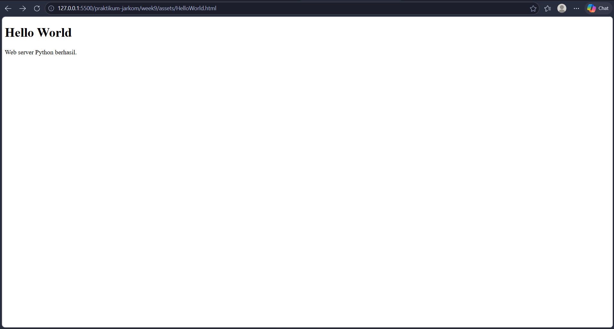
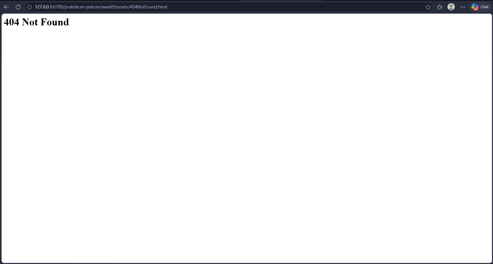

# **LAPORAN PRAKTIKUM JARINGAN KOMPUTER - MODUL 9**
## **WEB SERVER**

### **Identitas Mahasiswa**
**Nama:** Albertio Suranta Ginting  
**NIM:** 103072400128  
**Kelas:** IF - 04 - 01

---

## A. Tujuan Praktikum
1. Membuat program web server sederhana berbasis TCP socket programming

---

### B. Dasar Teori
Secara umum, *web server* merupakan perangkat lunak yang berfungsi merespons permintaan (HTTP *request*) yang dikirimkan oleh klien, seperti *web browser*. Pada modul ini, sebuah *web server* dasar disimulasikan menggunakan skrip Python yang berjalan di atas protokol transmisi TCP.

Alur kerja sistematis dari *web server* sederhana ini meliputi tahapan berikut:
1. Menginisiasi objek *socket* berjenis TCP (`SOCK_STREAM`).
2. Menautkan (*bind*) *socket* tersebut ke alamat IP dan nomor *port* yang telah ditentukan.
3. Menyiapkan mode siaga (*listen*) untuk mengantisipasi datangnya koneksi dari klien.
4. Menerima (*accept*) koneksi yang masuk, sekaligus melahirkan *socket* khusus untuk melayani sesi klien tersebut.
5. Menangkap *request* HTTP yang ditransmisikan oleh klien.
6. Membedah (*parsing*) teks *request* untuk mengekstrak rincian nama berkas (*file*) yang dicari.
7. Membaca isi berkas yang diminta melalui direktori penyimpanan lokal.
8. Menyusun *response* HTTP yang menyertakan *header* kode status (misalnya, `200 OK` jika ada, atau `404 Not Found` jika tidak ada) lalu diikuti oleh isi konten berkas.
9. Mentransmisikan *response* yang sudah disusun kembali ke klien melalui *socket* sesi.
10. Memutus dan menutup *socket* koneksi setelah data selesai dikirim.

Sistem harus diprogram agar mengembalikan pesan *error* standar "404 Not Found" apabila berkas yang diakses klien tidak tersedia di sistem.

---

## C. Implementasi dan Langkah Kerja

**1. Penyiapan Berkas Target HTML** Buatlah berkas HTML sederhana sebagai objek yang akan diminta oleh klien.

**Nama File:** `HelloWorld.html`
```html
<!DOCTYPE html>
<html>
<head>
    <title>Hello World</title>
</head>
<body>
    <h1>Hello World</h1>
    <p>Web server Python berhasil.</p>
</body>
</html>
```

**2. Penyusunan Kode Server** Melengkapi bagian kosong (*skeleton code*) pada berkas `server.py` sesuai instruksi pada modul. Di bawah ini adalah struktur akhir kodenya:

```python
#import socket module
from socket import *
import sys # In order to terminate the program

serverSocket = socket(AF_INET, SOCK_STREAM)

#Prepare a sever socket
#Fill in start
serverPort = 6789
serverSocket.bind(('', serverPort))
serverSocket.listen(1)
#Fill in end

while True:
    print('Ready to serve...')
    connectionSocket, addr = serverSocket.accept()

    try:
        message = connectionSocket.recv(1024).decode()
        filename = message.split()[1]

        f = open(filename[1:])
        outputdata = f.read()

        connectionSocket.send("HTTP/1.1 200 OK\r\n\r\n".encode())

        for i in range(0, len(outputdata)):
            connectionSocket.send(outputdata[i].encode())

        connectionSocket.send("\r\n".encode())
        connectionSocket.close()

    except IOError:
        #Send response message for file not found
        connectionSocket.send("HTTP/1.1 404 Not Found\r\n\r\n".encode())
        connectionSocket.send(
            "<html><body><h1>404 Not Found</h1></body></html>".encode()
        )

        #Close client socket
        connectionSocket.close()

serverSocket.close()
sys.exit() #Terminate the program after sending the corresponding data
```

---

## D. Hasil Praktikum

### 1. Screenshot HTML


### 2. Screenshot HTML Not Found


---

## E. Kesimpulan

Dari praktikum modul ini, dapat disimpulkan beberapa hal sebagai berikut:
1. Praktikum berhasil menciptakan program *web server* fungsional bermodalkan Python Socket, yang secara efektif melayani *request* HTTP tingkat dasar.
2. Terdapat pemahaman teknis mengenai tata cara *server* TCP dalam mempersiapkan koneksi, yang mana tahapan `bind`, `listen`, dan `accept` bersifat wajib dilakukan sebelum proses I/O terjadi.
3. Terbukti bahwa anatomi format HTTP sangat krusial dalam komunikasi jaringan, khususnya penerapan *status code* untuk menginformasikan kondisi terkini kepada klien (`200 OK` untuk keberhasilan, `404 Not Found` untuk kegagalan pencarian berkas).
4. Mekanisme penanganan *error* (penerapan *try-except*) memungkinkan *server* untuk merespons klien secara dinamis berdasarkan ketersediaan berkas (*file*) yang dicari tanpa menyebabkan program *crash*.

---